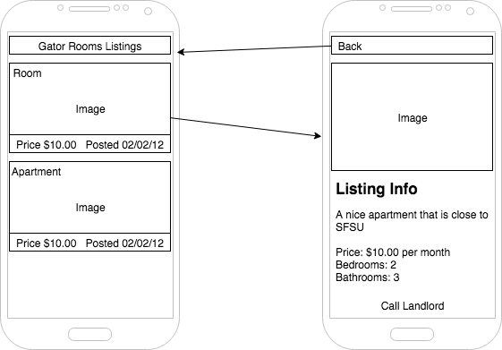

# Aliaksei Siarheyeu - SFSU CSC 690 Final Project

App Name: Gator Rooms IOS

### Description
The goal of this project is to create an app for IOS
that would allow the users of the Gator Rooms WebSite ( created in CSS 648 class ) to view the listings for rent and being able to contact a landord.

Gator Rooms - a website that allows the users to view and post rooms, apartments, and houses for rent.

### Must Have Features
* Load listings from the API and Display them in table view
* Sort By Date and Price
* Show listing details ( Address, full details, price )
* Allow user to contact the landloard. ( Presse Contact Button that woul trigger the call this number pop up )

### Nice-to-have Features
* Log In ( to allow user to view the profile )
* Ability to create listings right from mobile app.

## Wire frames

